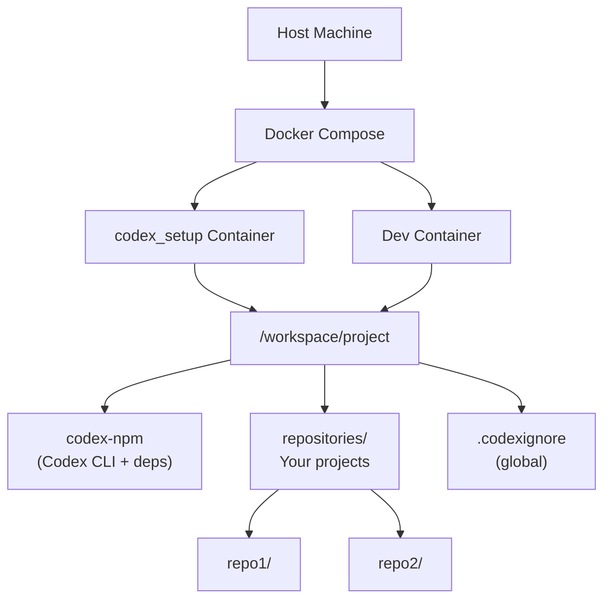

## Purpose

Set up a safe environment for running Codex.

For the full specification of Codex, see:  
https://platform.openai.com/docs/codex/overview

## Setup

### 1. Prepare Codex via Setup Container

First, pull the required images:

```bash
docker compose pull
```

Then, set up the local directory using the setup container.
The .codexignore file here is a global ignore list.
It is recommended to also create a .codexignore file in each repository (next step).

***

```bash
docker compose run --rm --entrypoint /bin/bash codex_setup -lc '
  mkdir -p /workspace/project/{codex-npm,repositories} &&
  cd /workspace/project/codex-npm &&
  npm init -y &&
  npm i -D @openai/codex

  cat > .codexignore <<'EOF'
  # Build outputs
  dist/
  build/

  # Dependencies
  node_modules/
  vendor/

  # Environment / secrets
  .env
  *.pem
  *.key
  secrets.*
  *.crt

  # Logs / temp
  *.log
  tmp/
  .cache/

  # Archives / large binaries
  *.zip
  *.tar.gz
  *.rar
  *.7z

  # OS / editor junk
  .DS_Store
  Thumbs.db
  *.swp
  *.swo
  EOF
  '
```

### 2. Prepare Your Workspace

Clone your repository or create a new one under:

```bash
workspace/repositories
```

It is strongly recommended to keep your source code here.

### 3.Run Codex via Dev Container

Below are example commands for running Codex with different approval policies.

#### --ask-for-approval <APPROVAL_POLICY> 

```bash
docker compose run --rm --entrypoint /bin/bash codex_setup -lc '
  cd /workspace/project/repositories &&
 npx --prefix /workspace/project/codex-npm codex \
  --sandbox workspace-write --ask-for-approval on-request'
```

#### -full-auto

```bash
docker compose run --rm --entrypoint /bin/bash codex_setup -lc '
  cd /workspace/project/repositories &&
 npx --prefix /workspace/project/codex-npm codex \
  --sandbox workspace-write --full-auto'
```

#### --dangerously-bypass-approvals-and-sandbox

**⚠ Extremely dangerous** — runs without sandboxing or confirmation prompts.
Use only in trusted, fully isolated environments.

```bash
docker compose run --rm --entrypoint /bin/bash codex_setup -lc '
  cd /workspace/project/repositories &&
 npx --prefix /workspace/project/codex-npm codex \
  --sandbox workspace-write --dangerously-bypass-approvals-and-sandbox'
```

### structure



## License

This project is licensed under the Apache License 2.0 - see the [LICENSE](LICENSE) file for details.